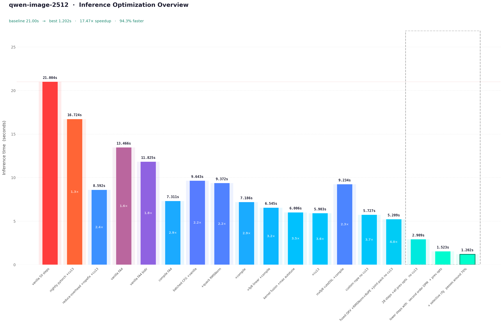

<div align="center">
  <h1>Qwen-Image-2512 optimizations on a B200</h1>
  
  <h4><a href="https://x.com/Shauray7">Shauray</a></h4>
  
  
</div>

## Overview

There are a heck ton of kernels in the `kernel/` folder. I decided to include a few that I didn't even end up using because they weren't that good, but the sheer number of hours I spent on them meant I had to include them. Just navigate the repo it's not that huge and if you are here you have enough knowledge to navigate and understand the kernels and if not here's the blog where I've explained pretty much everything on this repo - 
<a href="https://shauray8.github.io/about_shauray/blogs/qwen_image_optimizations.html">Optimizing Qwen-Image-2512 on a B200: A Deep Dive</a>
## Results

<table>
  <tr>
    <th align="center">Baseline</th>
    <th align="center">After all the basic stuff</th>
    <th align="center">Current output</th>
  </tr>
  <tr>
    <td align="center"></td>
    <td align="center"></td>
    <td align="center"></td>
  </tr>
</table>

There are a lot of samples in between these all of that is in the `assets/` folder

## Usability

Install nightly PyTorch (as of March 10, 2026) with CUDA 13 and compatible Triton for better timings:

```bash
pip install -r requirements.txt
cd src
python infer.py
```
Check the args - you can switch between schedulers and different infer script versions. Try it out, see if you can make it faster.
